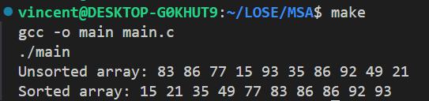

# Multithreaded Sorting Application
## Problem

Write a multithreaded sorting program that works as follows: A list of integers is divided into two smaller lists of equal size. Two separate threads sort each sublist using a sorting algorithm of your choice. The two sublists are then merged by a third thread.

## Solution
The solution is implemented in C using pthreads. The program generates a random list of integers and then divides the list into two sublists. Two threads are created to sort the sublists using the quicksort algorithm. The sorted sublists are then merged by a third thread. The program did not use any synchronization primitives as the threads are working on different parts of the list. The program uses the following functions:

- `runner`: The function that is executed by each thread. The function takes a pointer to a `struct` that contains the list, the start index, and the end index of the sublist to be sorted. The function sorts the sublist using the quicksort algorithm.
- `swap`: A helper function that swaps two elements in the list.
- `partition`: A helper function that partitions the list around a pivot element.
- `quicksort`: The function that implements the quicksort algorithm.
- `generateRandomArray`: A function that generates a random list of integers.

In this implementation, quick_sort function opens two threads to sort the two sublists. runnner function is called by each thread to sort the sublist. The main thread waits for the two threads to finish sorting the sublists. The main thread then merges the two sorted sublists into a single sorted list. It seems that the overhead of creating and joining threads is not affecting the performance of the program. 

## Instructions

To compile and run the program, use the following commands:

```bash
make
```

Note: the array size is set to 10 by default. 

## Screenshots

The following screenshot shows the output of the program:

