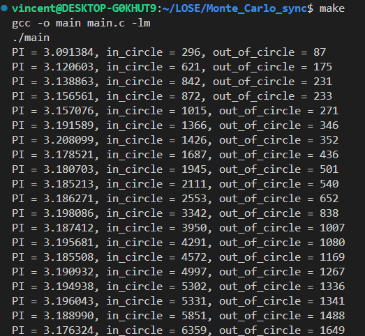

# General
This program estimates the value of pi using the Monte Carlo method. It generates a specified number of random points within a unit square and determines how many fall within the unit circle inscribed in that square. By comparing the ratio of points inside the circle to the total number of points, it estimates the value of pi.

# Usage
To compile and run the program, execute the following commands:

```bash
make
```

The program will initiate multiple threads to generate random points and estimate the value of pi using the Monte Carlo method. 

# Implementation
The main part of program is `runner` function.
It receive a parameter `n`, which represents the number of random points to generate. Within the `runner` function, each thread generates random points and determines whether they fall within the unit circle. The total number of points inside the circle is accumulated, and the estimation of pi is calculated based on the ratio of points inside the circle to the total number of points.


# Screenshots
The following screenshots illustrate the program's execution and output for estimating the value of pi using the Monte Carlo method with 20 threads. Each thread generates random points and calculates the estimation of pi based on the ratio of points inside the circle to the total number of points.

