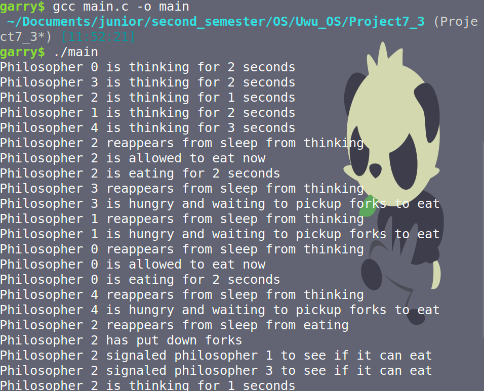

# LOSE

Dining Philosophers Problem: Implementation and Analysis
Introduction

The Dining Philosophers problem is a classic synchronization problem in computer science. It illustrates the challenges of resource allocation and deadlock prevention in concurrent programming. In this report, we present an implementation of the Dining Philosophers problem using pthreads in C programming language.
Implementation Details

Our implementation consists of the following components:

    Philosopher Threads: We create five philosopher threads, each representing a philosopher in the dining scenario. These threads execute the philosopher() function, which simulates the behavior of a philosopher.

    Mutex Lock and Conditional Variables: We use a mutex lock to ensure mutual exclusion when accessing shared resources (forks) and conditional variables to coordinate the actions of philosophers.

    Enum for Philosopher States: We define an enumeration representing the possible states of a philosopher: THINKING, HUNGRY, and EATING. Each philosopher maintains its state and transitions between states as per the rules of the problem.

    Functions for Thinking, Eating, and Handling Forks: We implement functions for simulating the actions of philosophers, including thinking, picking up forks, eating, and returning forks. These functions ensure proper synchronization and prevent deadlocks by adhering to the rules of the Dining Philosophers problem.

Key Functions

    think(int id): Simulates the philosopher thinking for a random duration.

    pickup_forks(int id): Attempts to pick up the forks necessary for eating while adhering to the rules of the problem. If the forks are not available, the philosopher waits until they can be acquired.

    eat(int id): Simulates the philosopher eating for a random duration.

    return_forks(int id): Returns the forks after eating and signals adjacent philosophers to check if they can start eating.

Results and Discussion

Our implementation successfully prevents deadlocks and starvation by using mutex locks and conditional variables to coordinate the actions of philosophers. Each philosopher adheres to the rules of picking up forks only when both are available and returning them promptly after eating. Through random durations for thinking and eating, we introduce variability into the system, preventing deterministic patterns that could lead to deadlocks.
Conclusion

In conclusion, we have presented an effective implementation of the Dining Philosophers problem using pthreads in C. Our solution demonstrates proper synchronization and deadlock prevention techniques, ensuring that all philosophers can dine peacefully without encountering conflicts over shared resources.