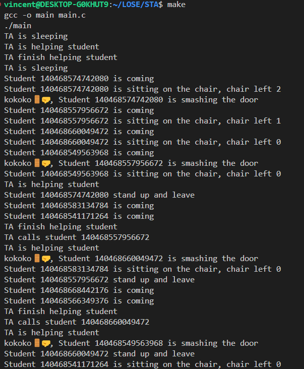

# General

This code simulates a scenario where students are waiting for assistance from a teaching assistant (TA). The TA can help one student at a time, and there are a limited number of chairs available for students to wait in. When a student arrives and finds all chairs occupied, they leave and come back later. Each student waits for a random period before coming for assistance.

# Usage

To compile and run the code, you need a C compiler that supports POSIX threads. Additionally, the code utilizes the `mpg123` command-line utility to play a knocking sound when a student tries to get the TA's attention.

Ensure you have `mpg123` installed on your system before running the code. You can install it using your package manager (e.g., `apt`, `yum`, `brew`, etc.).

Compile the code using the following command:

```
gcc -o main main.c
```

After compilation, execute the program:

```
./main
```

And if you are lazy, type
```bash
make
```

# Implementation

The implementation consists of several parts:

1. **Constants**: 
   - `CHAIR_NUM`: Defines the number of chairs available for students to wait.
   - `STUDENT_NUM`: Defines the number of student threads.

2. **Global Variables**:
   - `pthread_mutex_t queue_mutex`: Mutex for protecting access to the student queue.
   - `sem_t ta_sleeping`: Semaphore to signal the TA is sleeping.
   - `sem_t chairs`: Semaphore to control the number of available chairs.
   - `sem_t ta_finish`: Semaphore to signal the TA has finished assisting a student.
   - `typedef struct student_queue`: Defines a structure for the student queue, consisting of the student thread and a pointer to the next student.

3. **Queue Operations**:
   - `pop()`: Removes the first student from the queue.
   - `push(pthread_t student_thread)`: Adds a student to the end of the queue.

4. **Thread Functions**:
   - `teaching_assistant(void *arg)`: Function executed by the TA thread. It continuously checks for students in the queue and assists them.
   - `student(void *arg)`: Function executed by student threads. Students arrive, wait for a random period, try to sit on a chair, knock on the TA's door, and leave after receiving assistance.

5. **Main Function**:
   - Initializes semaphores and mutex.
   - Creates TA and student threads.
   - Waits for all threads to finish execution.

6. **Synchronization**:
   - `pthread_mutex_t queue_mutex`: Protects access to the student queue.
   - `sem_t ta_sleeping`: Indicates whether the TA is available for assistance.
   - `sem_t chairs`: Controls the number of available chairs for students to wait.
   - `sem_t ta_finish`: Signals when the TA has finished assisting a student.

7. **Student Arrival Simulation**:
   - Students arrive at random intervals, try to sit on a chair, knock on the TA's door, and leave after assistance.

Note that user may crank up the number of students to see how the TA handles the situation when there are more students than chairs available. The observation suggests that the TA can never sleep ~~when so many students are dumb enough to come at the same time.~~ As a result, the TA will never execute `sem_wait(&ta_sleeping);` and students will not be able to wake up the TA using `sem_post(&ta_sleeping);`. The student threads number should be slightly more than the number of chairs to see the TA sleeping and waking up when a student knocks on the door. 

# Screenshots
The screenshots is the partial output of the program because the program runs indefinitely until the user stops it.
