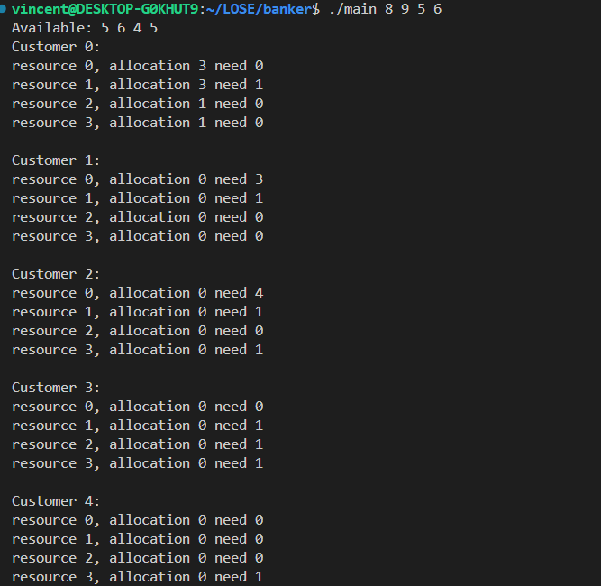

# Banker's algorithm
## Introduction
This is a simple program that demonstrates the Banker's algorithm for deadlock avoidance.

## Usage
Run the following command:

```bash
gcc -o main main.c
./main 8 9 5 6
```

## Implementation
### 1. Safety Algorithm
The safety algorithm is implemented in the `safe_algorithm` function. The function takes the current state of the system and the request of a customer as input. It then simulates the allocation of the requested resources to the customer and checks if the system is in a safe state. If the system is in a unsafe state, the function returns -1; otherwise, it returns 0.
### 2. Request Resources
In the `request_resources` function, the program takes the request of a customer as input and checks if the request can be granted using the customer's need and the available resources. If the request can be granted, the program updates the available resources and checks if the system is in a safe state using the safety algorithm. If the system is in a safe state, the program grants the request; otherwise, it denies the request and aborts the process.
### 3. Release Resources
If the request is granted, the program updates the available resources and releases the resources allocated to the customer.
### 4. Customer Threads
The program creates a thread for each customer and simulates the request and release of resources by the customer.

In this implementation, the will be ended when because each customer request random resources less than the need of the customer, which will cause the system to be in a safe state for the most of the time. The program will end when all the customers have finished their requests and released their resources.

## Screenshots
It is unrealistic to provide full screenshots of the program. Here is a snippet of the output:


the full output is given below:

vincent@DESKTOP-G0KHUT9:~/LOSE/banker$ ./main 8 9 5 6
Available: 5 6 4 5 
Customer 0:
resource 0, allocation 3 need 0
resource 1, allocation 3 need 1
resource 2, allocation 1 need 0
resource 3, allocation 1 need 0

Customer 1:
resource 0, allocation 0 need 3
resource 1, allocation 0 need 1
resource 2, allocation 0 need 0
resource 3, allocation 0 need 0

Customer 2:
resource 0, allocation 0 need 4
resource 1, allocation 0 need 1
resource 2, allocation 0 need 0
resource 3, allocation 0 need 1

Customer 3:
resource 0, allocation 0 need 0
resource 1, allocation 0 need 1
resource 2, allocation 0 need 1
resource 3, allocation 0 need 1

Customer 4:
resource 0, allocation 0 need 0
resource 1, allocation 0 need 0
resource 2, allocation 0 need 0
resource 3, allocation 0 need 1

Available: 5 6 4 5 
Customer 0:
resource 0, allocation 3 need 0
resource 1, allocation 3 need 1
resource 2, allocation 1 need 0
resource 3, allocation 1 need 0

Customer 1:
resource 0, allocation 0 need 3
resource 1, allocation 0 need 1
resource 2, allocation 0 need 0
resource 3, allocation 0 need 0

Customer 2:
resource 0, allocation 0 need 4
resource 1, allocation 0 need 1
resource 2, allocation 0 need 0
resource 3, allocation 0 need 1

Customer 3:
resource 0, allocation 0 need 0
resource 1, allocation 0 need 1
resource 2, allocation 0 need 1
resource 3, allocation 0 need 1

Customer 4:
resource 0, allocation 0 need 0
resource 1, allocation 0 need 0
resource 2, allocation 0 need 0
resource 3, allocation 0 need 1

Available: 3 5 4 5 
Customer 0:
resource 0, allocation 3 need 0
resource 1, allocation 3 need 1
resource 2, allocation 1 need 0
resource 3, allocation 1 need 0

Customer 1:
resource 0, allocation 0 need 3
resource 1, allocation 0 need 1
resource 2, allocation 0 need 0
resource 3, allocation 0 need 0

Customer 2:
resource 0, allocation 2 need 2
resource 1, allocation 1 need 0
resource 2, allocation 0 need 0
resource 3, allocation 0 need 1

Customer 3:
resource 0, allocation 0 need 0
resource 1, allocation 0 need 1
resource 2, allocation 0 need 1
resource 3, allocation 0 need 1

Customer 4:
resource 0, allocation 0 need 0
resource 1, allocation 0 need 0
resource 2, allocation 0 need 0
resource 3, allocation 0 need 1

Available: 3 5 3 4 
Customer 0:
resource 0, allocation 3 need 0
resource 1, allocation 3 need 1
resource 2, allocation 1 need 0
resource 3, allocation 1 need 0

Customer 1:
resource 0, allocation 0 need 3
resource 1, allocation 0 need 1
resource 2, allocation 0 need 0
resource 3, allocation 0 need 0

Customer 2:
resource 0, allocation 2 need 2
resource 1, allocation 1 need 0
resource 2, allocation 0 need 0
resource 3, allocation 0 need 1

Customer 3:
resource 0, allocation 0 need 0
resource 1, allocation 0 need 1
resource 2, allocation 1 need 0
resource 3, allocation 1 need 0

Customer 4:
resource 0, allocation 0 need 0
resource 1, allocation 0 need 0
resource 2, allocation 0 need 0
resource 3, allocation 0 need 1

Available: 1 5 3 4 
Customer 0:
resource 0, allocation 3 need 0
resource 1, allocation 3 need 1
resource 2, allocation 1 need 0
resource 3, allocation 1 need 0

Customer 1:
resource 0, allocation 2 need 1
resource 1, allocation 0 need 1
resource 2, allocation 0 need 0
resource 3, allocation 0 need 0

Customer 2:
resource 0, allocation 2 need 2
resource 1, allocation 1 need 0
resource 2, allocation 0 need 0
resource 3, allocation 0 need 1

Customer 3:
resource 0, allocation 0 need 0
resource 1, allocation 0 need 1
resource 2, allocation 1 need 0
resource 3, allocation 1 need 0

Customer 4:
resource 0, allocation 0 need 0
resource 1, allocation 0 need 0
resource 2, allocation 0 need 0
resource 3, allocation 0 need 1

Available: 1 4 3 4 
Customer 0:
resource 0, allocation 3 need 0
resource 1, allocation 4 need 0
resource 2, allocation 1 need 0
resource 3, allocation 1 need 0

Customer 1:
resource 0, allocation 2 need 1
resource 1, allocation 0 need 1
resource 2, allocation 0 need 0
resource 3, allocation 0 need 0

Customer 2:
resource 0, allocation 2 need 2
resource 1, allocation 1 need 0
resource 2, allocation 0 need 0
resource 3, allocation 0 need 1

Customer 3:
resource 0, allocation 0 need 0
resource 1, allocation 0 need 1
resource 2, allocation 1 need 0
resource 3, allocation 1 need 0

Customer 4:
resource 0, allocation 0 need 0
resource 1, allocation 0 need 0
resource 2, allocation 0 need 0
resource 3, allocation 0 need 1

Available: 4 8 4 5 
Customer 0:
resource 0, allocation 0 need 0
resource 1, allocation 0 need 0
resource 2, allocation 0 need 0
resource 3, allocation 0 need 0

Customer 1:
resource 0, allocation 2 need 1
resource 1, allocation 0 need 1
resource 2, allocation 0 need 0
resource 3, allocation 0 need 0

Customer 2:
resource 0, allocation 2 need 2
resource 1, allocation 1 need 0
resource 2, allocation 0 need 0
resource 3, allocation 0 need 1

Customer 3:
resource 0, allocation 0 need 0
resource 1, allocation 0 need 1
resource 2, allocation 1 need 0
resource 3, allocation 1 need 0

Customer 4:
resource 0, allocation 0 need 0
resource 1, allocation 0 need 0
resource 2, allocation 0 need 0
resource 3, allocation 0 need 1

Available: 4 8 4 5 
Customer 0:
resource 0, allocation 0 need 0
resource 1, allocation 0 need 0
resource 2, allocation 0 need 0
resource 3, allocation 0 need 0

Customer 1:
resource 0, allocation 2 need 1
resource 1, allocation 0 need 1
resource 2, allocation 0 need 0
resource 3, allocation 0 need 0

Customer 2:
resource 0, allocation 2 need 2
resource 1, allocation 1 need 0
resource 2, allocation 0 need 0
resource 3, allocation 0 need 1

Customer 3:
resource 0, allocation 0 need 0
resource 1, allocation 0 need 1
resource 2, allocation 1 need 0
resource 3, allocation 1 need 0

Customer 4:
resource 0, allocation 0 need 0
resource 1, allocation 0 need 0
resource 2, allocation 0 need 0
resource 3, allocation 0 need 1

Available: 2 8 4 5 
Customer 0:
resource 0, allocation 0 need 0
resource 1, allocation 0 need 0
resource 2, allocation 0 need 0
resource 3, allocation 0 need 0

Customer 1:
resource 0, allocation 2 need 1
resource 1, allocation 0 need 1
resource 2, allocation 0 need 0
resource 3, allocation 0 need 0

Customer 2:
resource 0, allocation 4 need 0
resource 1, allocation 1 need 0
resource 2, allocation 0 need 0
resource 3, allocation 0 need 1

Customer 3:
resource 0, allocation 0 need 0
resource 1, allocation 0 need 1
resource 2, allocation 1 need 0
resource 3, allocation 1 need 0

Customer 4:
resource 0, allocation 0 need 0
resource 1, allocation 0 need 0
resource 2, allocation 0 need 0
resource 3, allocation 0 need 1

Available: 2 8 4 5 
Customer 0:
resource 0, allocation 0 need 0
resource 1, allocation 0 need 0
resource 2, allocation 0 need 0
resource 3, allocation 0 need 0

Customer 1:
resource 0, allocation 2 need 1
resource 1, allocation 0 need 1
resource 2, allocation 0 need 0
resource 3, allocation 0 need 0

Customer 2:
resource 0, allocation 4 need 0
resource 1, allocation 1 need 0
resource 2, allocation 0 need 0
resource 3, allocation 0 need 1

Customer 3:
resource 0, allocation 0 need 0
resource 1, allocation 0 need 1
resource 2, allocation 1 need 0
resource 3, allocation 1 need 0

Customer 4:
resource 0, allocation 0 need 0
resource 1, allocation 0 need 0
resource 2, allocation 0 need 0
resource 3, allocation 0 need 1

Available: 2 8 4 4 
Customer 0:
resource 0, allocation 0 need 0
resource 1, allocation 0 need 0
resource 2, allocation 0 need 0
resource 3, allocation 0 need 0

Customer 1:
resource 0, allocation 2 need 1
resource 1, allocation 0 need 1
resource 2, allocation 0 need 0
resource 3, allocation 0 need 0

Customer 2:
resource 0, allocation 4 need 0
resource 1, allocation 1 need 0
resource 2, allocation 0 need 0
resource 3, allocation 0 need 1

Customer 3:
resource 0, allocation 0 need 0
resource 1, allocation 0 need 1
resource 2, allocation 1 need 0
resource 3, allocation 1 need 0

Customer 4:
resource 0, allocation 0 need 0
resource 1, allocation 0 need 0
resource 2, allocation 0 need 0
resource 3, allocation 1 need 0

Available: 2 7 4 5 
Customer 0:
resource 0, allocation 0 need 0
resource 1, allocation 0 need 0
resource 2, allocation 0 need 0
resource 3, allocation 0 need 0

Customer 1:
resource 0, allocation 2 need 1
resource 1, allocation 0 need 1
resource 2, allocation 0 need 0
resource 3, allocation 0 need 0

Customer 2:
resource 0, allocation 4 need 0
resource 1, allocation 1 need 0
resource 2, allocation 0 need 0
resource 3, allocation 0 need 1

Customer 3:
resource 0, allocation 0 need 0
resource 1, allocation 1 need 0
resource 2, allocation 1 need 0
resource 3, allocation 1 need 0

Customer 4:
resource 0, allocation 0 need 0
resource 1, allocation 0 need 0
resource 2, allocation 0 need 0
resource 3, allocation 0 need 0

Available: 2 8 5 5 
Customer 0:
resource 0, allocation 0 need 0
resource 1, allocation 0 need 0
resource 2, allocation 0 need 0
resource 3, allocation 0 need 0

Customer 1:
resource 0, allocation 2 need 1
resource 1, allocation 0 need 1
resource 2, allocation 0 need 0
resource 3, allocation 0 need 0

Customer 2:
resource 0, allocation 4 need 0
resource 1, allocation 1 need 0
resource 2, allocation 0 need 0
resource 3, allocation 1 need 0

Customer 3:
resource 0, allocation 0 need 0
resource 1, allocation 0 need 0
resource 2, allocation 0 need 0
resource 3, allocation 0 need 0

Customer 4:
resource 0, allocation 0 need 0
resource 1, allocation 0 need 0
resource 2, allocation 0 need 0
resource 3, allocation 0 need 0

Available: 6 8 5 6 
Customer 0:
resource 0, allocation 0 need 0
resource 1, allocation 0 need 0
resource 2, allocation 0 need 0
resource 3, allocation 0 need 0

Customer 1:
resource 0, allocation 2 need 1
resource 1, allocation 1 need 0
resource 2, allocation 0 need 0
resource 3, allocation 0 need 0

Customer 2:
resource 0, allocation 0 need 0
resource 1, allocation 0 need 0
resource 2, allocation 0 need 0
resource 3, allocation 0 need 0

Customer 3:
resource 0, allocation 0 need 0
resource 1, allocation 0 need 0
resource 2, allocation 0 need 0
resource 3, allocation 0 need 0

Customer 4:
resource 0, allocation 0 need 0
resource 1, allocation 0 need 0
resource 2, allocation 0 need 0
resource 3, allocation 0 need 0

Available: 6 8 5 6 
Customer 0:
resource 0, allocation 0 need 0
resource 1, allocation 0 need 0
resource 2, allocation 0 need 0
resource 3, allocation 0 need 0

Customer 1:
resource 0, allocation 2 need 1
resource 1, allocation 1 need 0
resource 2, allocation 0 need 0
resource 3, allocation 0 need 0

Customer 2:
resource 0, allocation 0 need 0
resource 1, allocation 0 need 0
resource 2, allocation 0 need 0
resource 3, allocation 0 need 0

Customer 3:
resource 0, allocation 0 need 0
resource 1, allocation 0 need 0
resource 2, allocation 0 need 0
resource 3, allocation 0 need 0

Customer 4:
resource 0, allocation 0 need 0
resource 1, allocation 0 need 0
resource 2, allocation 0 need 0
resource 3, allocation 0 need 0

Available: 5 8 5 6 
Customer 0:
resource 0, allocation 0 need 0
resource 1, allocation 0 need 0
resource 2, allocation 0 need 0
resource 3, allocation 0 need 0

Customer 1:
resource 0, allocation 3 need 0
resource 1, allocation 1 need 0
resource 2, allocation 0 need 0
resource 3, allocation 0 need 0

Customer 2:
resource 0, allocation 0 need 0
resource 1, allocation 0 need 0
resource 2, allocation 0 need 0
resource 3, allocation 0 need 0

Customer 3:
resource 0, allocation 0 need 0
resource 1, allocation 0 need 0
resource 2, allocation 0 need 0
resource 3, allocation 0 need 0

Customer 4:
resource 0, allocation 0 need 0
resource 1, allocation 0 need 0
resource 2, allocation 0 need 0
resource 3, allocation 0 need 0

vincent@DESKTOP-G0KHUT9:~/LOSE/banker$ 

## Special Thanks
Thanks to [catjam](https://github.com/Error0229) for providing valuable feedback and suggestions for the program.