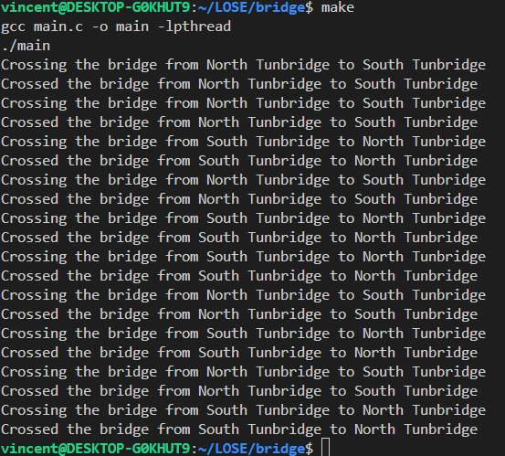

# Problem

Create separate threads for northbound and southbound farmers using POSIX synchronization. When a farmer is on the bridge, the thread will sleep for a random period to simulate travel. The program should support creating multiple threads for both northbound and southbound farmers.
# Usage

```bash
make
```

# Implementation
Two types of threads are created: `northbound` and `southbound`. Each thread represents a farmer traveling in the respective direction. The threads are synchronized using mutex. The bridge is represented by a mutex, which ensures that only one farmer can cross the bridge at a time. 

# Screenshots
