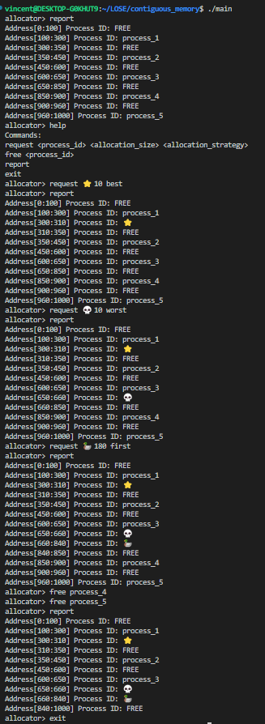

# Contiguous Memory
## Introduction

This is a simple program that demonstrates how contiguous memory is allocated in C.

## Usage

run the following command:
```bash
make
```
type `help` to see the available commands.

## Implementation

### Data Structures:
1. **Block Structure (block_t):**
   - Represents a memory block.
   - Contains fields for start address, available space, process ID, and a pointer to the next block.

### Functions:
1. **Memory Allocation Strategies:**
   - **First Fit (`find_first_fit`):**
     - Searches for the first available memory block that fits the allocation size.
   - **Best Fit (`find_best_fit`):**
     - Searches for the memory block that best fits the allocation size.
   - **Worst Fit (`find_worst_fit`):**
     - Searches for the memory block that worst fits the allocation size.

3. **free_blocks:**
   - Frees all memory blocks associated with the given process ID.
   - `merge_unused_adjacent_blocks` is called after freeing the blocks.

4. **allocate_blocks:**
   - Allocates memory blocks for the given process ID after the block is found using the allocation strategy.
   - `init_block` is called to initialize the block.

5. **request_block:**
   - Requests memory blocks for the given process ID using specified allocation strategy.

6. **free_list:**
   - free the linked list of blocks.

7. **setup_memory_state:**
   - Initializes the memory state for easy demonstration.

8. **report_memory_usage:**
   - Reports the memory usage.

## Screenshots
