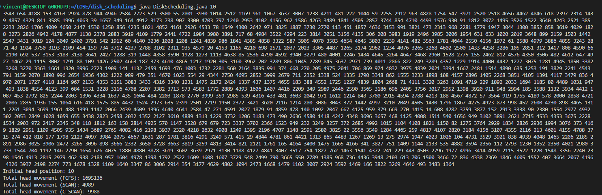

# Disk Scheduling Algorithms Simulation

This Java program simulates different disk scheduling algorithms: FCFS (First-Come, First-Served), SCAN, and C-SCAN. It generates a set of random disk access requests and calculates the total head movement for each algorithm, given an initial head position.

## Table of Contents

- [Installation](#installation)
- [Usage](#usage)
- [Disk Scheduling Algorithms](#disk-scheduling-algorithms)
  - [FCFS (First-Come, First-Served)](#fcfs-first-come-first-served)
  - [SCAN](#scan)
  - [C-SCAN](#c-scan)
- [Screenshots](#screenshots)

## Requirements

- JDK (Java Development Kit) >= 11

## Usage

To run the program,
```bash
java Disk_Scheduling.java <initial_head_position>
```

### Arguments

- `initial_head_position`: The initial position of the disk head.

For example:

```bash
java Disk_Scheduling.java 10
```
## Disk Scheduling Algorithms

### FCFS (First-Come, First-Served)

In the FCFS algorithm, disk access requests are serviced in the order they arrive. This can lead to high total head movement, especially if requests are randomly distributed.

### SCAN

The SCAN algorithm (also known as the elevator algorithm) services requests in one direction until it reaches the end, then reverses direction and services remaining requests. This reduces the variance in head movement compared to FCFS.

### C-SCAN

The C-SCAN algorithm (Circular SCAN) is similar to SCAN, but instead of reversing direction at the end, the disk head jumps back to the beginning and starts servicing requests in the same direction. This provides a more uniform wait time for requests.

## Screenshots

