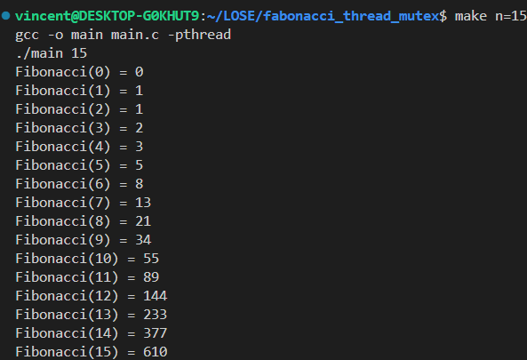

# General
This document outlines a multithreaded implementation of the Fibonacci sequence calculation using the fast doubling algorithm in C programming language. The program employs POSIX threads for concurrency and optimization techniques to enhance performance.

# Usage
By default, the program calculates Fibonacci numbers using `fast_fibonacci` function, leveraging the fast doubling algorithm for efficient computation. To compile and run the program, execute the following commands, simply:
```bash
make n=15
```

A sequence of Fibonacci numbers up to the specified limit `n`(in this example, 15) will be displayed, along with the elapsed time for computation. 
 
# Implementation
The program consists of the following components:

1. **Fast Doubling Algorithm**: The `fast_fibonacci` function implements the fast doubling algorithm to calculate Fibonacci numbers efficiently. The algorithm reduces the number of recursive calls by computing two Fibonacci numbers in a single function call.

2. **Multithreading**: The program uses POSIX threads to parallelize the computation of Fibonacci numbers. The `fibonacci_thread` function is responsible for creating and managing threads to calculate Fibonacci numbers concurrently.

3. **Semaphore**: The program uses a semaphore to synchronize the threads and ensure that the correct Fibonacci numbers are calculated in the correct order.

Once the thread stored the result in the shared memory, it will signal the semaphore to tell the main thread that the result is ready to be printed.

# Screenshots
