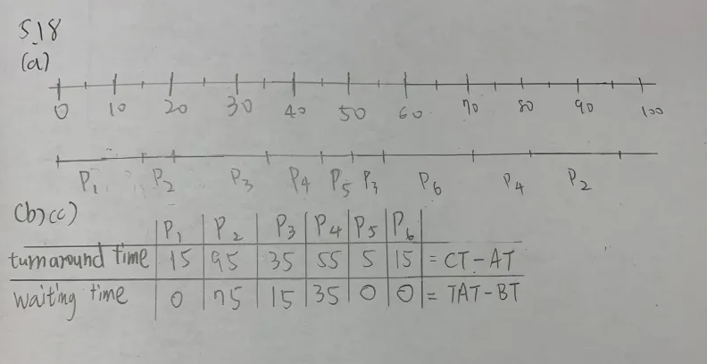

# 4.8
## Problem
Provide two programming examples in which multithreading does not provide better performance than a single-threaded solution.

## Answer
Multi-threading does not provide better performance than a single-threaded solution if the tasks are not parallelizable. 
For example, consider a program that performs a series of sequential tasks, where each task depends on the output of the previous task. In this case, multi-threading would not provide better performance, as the tasks cannot be executed concurrently.
Another example is a program that performs a series of I/O-bound tasks, where the bottleneck is the speed of the I/O operations rather than the processing power of the CPU. In this case, multi-threading would not provide better performance, as the tasks are limited by the speed of the I/O operations rather than the number of threads.

# 4.10
## Problem
Which of the following components of program state are shared across threads in a multithreaded process?
(a) Register values
(b) Heap memory
(c) Global variables
(d) Stack memory

## Answer
(b) Heap memory
(c) Global variables

Because register values and stack memory are thread-specific, they are not shared across threads in a multithreaded process. However, heap memory and global variables are shared across threads.

# 4.16
## Problem
A system with two dual-core processors has four processors available for scheduling

- A CPU-intensive application is running on this system
- All input is performed at program start-up, when a single file
must be opened
- Similarly, all output is performed just before the program terminates, when the program results must be written to a single file
- Between start-up and termination, the program is entirely CPUbound
- Your task is to improve the performance of this application by multithreading it
- The application runs on a system that uses the one-to-one threading model (each user thread maps to a kernel thread)
- How many threads will you create to perform the input and output? Explain.
- How many threads will you create for the CPU-intensive portion of the application?
Explain.

## Answer
For the input and output portions of the application, I would create two threads. One thread will be responsible for opening the file and reading the input, while the other thread will be responsible for writing the output to the file. By creating two threads, we can fully leverage the four processors available for scheduling, speeding up the input and output operations.

For the CPU-intensive portion of the application, four threads should be created in order to fully utilize the four processors available for scheduling. By creating more than four threads, the tasks will not be able to run concurrently. 
Created four threads will allow the CPU-intensive tasks to be executed in parallel, improving the performance of the application.

# 5.14
## Problem
Most scheduling algorithms maintain a run queue, which lists processes eligible to run on a processor. On multicore systems, there are two general options:

- (1) each processing core has its own run queue, or
- (2) a single run queue is shared by all processing
cores.
- What are the advantages and disadvantages
of each of these approaches?

## Answer
(1) The Advantages of each processing core having its own run queue:
- Reduced Contention: Ech core haas its own run queue, reducing contention for access to the run queue and improving performance.
- The scheduler only need to look no futher than its private run queue to find the next process to run.

(2) The Advantages of a single run queue shared by all processing cores:
- Load balancing: A single run queue can facilitate load balancing across cores, ensuring that processes are distributed evenly among the available cores.
- Simplicity: Managing a single run queue is simpler and may reduce the complexity of the scheduling algorithm.

# 5.18
## Problem
The following processes are being scheduled
using a preemptive, priority-based, round-robin scheduling algorithm.
- Each process is assigned a numerical priority, with a higher number indicating a higher relative priority.
- For processes with the same priority, a round-robin scheduler will be used with a time quantum of 10
units.
- If a process is preempted by a higher-priority process, the preempted process is placed at the end of the
queue.

| Thread | Priority | Burst | Arrival |
|--------|----------|-------|---------|
| P1     | 8       | 15    | 0       |
| P2     | 3       | 20    | 0      |
| P3     | 4       | 20    | 20      |
| P4     | 4       | 20    | 25      |
| P5     | 5        | 5    | 45     |
| P6     | 10      | 15    | 55     |

- (a) Show the scheduling order of the processes using a Gantt chart.
- (b) What is the turnaround time for each process?
- (c) What is the waiting time for each process?

## Answer



# 5.22
## Problem
Consider a system running ten I/O-bound tasks and one CPU-bound task. Assume that the I/O-bound tasks issue an I/O operation once for every millisecond of CPU computing and that each I/O operation takes 10 milliseconds to complete. Also assume that the context-switching overhead is 0.1 millisecond and that all processes are longrunning tasks. Describe the CPU utilization for a round-robin scheduler when:
- (a) The time quantum is 1 millisecond
- (b) The time quantum is 10 millisecond

## Answer
(a) When the time quantum is 1 millisecond:

Regardless of the CPU bounded or I/O bounded tasks, the scheduler interrupts, and process a 0.1 milliseconds of context-switching overhead. THe CPU utilization is 

(10 * 1 + 1) / (10 * 1 + 1 + 11 * 0.1) = 91%

(b) When the time quantum is 10 millisecond:
When time quantum is 10 millisecond, the brhavior of I/O bounded tasks remains the same. However, the CPU bounded task will be able to run for 10 milliseconds before being interrupted. The CPU utilization is 

(10 * 1 + 10) / (10 * 1 + 10 + 11 * 0.1) = 20 / 21.1 = 94%

# 5.25
## Problem
Explain the differences in how much the following scheduling algorithms discriminate in favor of short processes:
(a) FCFS
(b) RR
(c) Multilevel feedback queues 

## Answer
- (a) FCFS discriminates in favor of short processes because any short jobs arriving afterlong jobs will have longer waiting time.
- (b) RR treats all processes equally because every process is granted the same time quantum. Short processes will not have an advantage over long processes.
- (c) Multilevel feedback queues discriminate in favor of short processes because they are given higher priority in the scheduling algorithm. 

# 6.7
## Problem
The pseudocode of Figure 6.15 illustrates the basic push() and pop() operations of an array-based stack. Assuming that this algorithm could be used in a concurrent environment, answer the following questions:

- (a) What data have a race condition?
- (b) How could the race condition be fixed?

```
push(item){
    if(top < SIZE>){
        stack[top] = item;
        top++;
    }
    else
        ERROR
}

pop(){
    if(!is_empty()){
        top--;
        return stack[top];
    }
    else
        ERROR
}

is_empty(){
    return top == 0;
}
```

## Answer
(a)
The data that have a race condition are the `top` variable.
(b)
We apply a mutex lock to the `push()` and `pop()` operations to prevent race conditions. The mutex lock ensures that only one thread can access the stack at a time. The pseudocode with mutex locks is as follows:

```
mutex lock;

push(item){
    lock.acquire();
    if(top < SIZE>){
        stack[top] = item;
        top++;
    }
    else
        ERROR
    lock.release();
}

pop(){
    lock.acquire();
    if(!is_empty()){
        top--;
        lock.release();
        return stack[top];
    }
    else
        ERROR
    lock.release();
}

is_empty(){
    return top == 0;
}
```

In the above pseudocode, the `lock.acquire()` and `lock.release()` functions are used to acquire and release the mutex lock, respectively. This ensures that only one thread can access the stack at a time.

# 6.15 
## Problem
Explain why implementing synchronization primitives by disabling interrupts is not appropriate in a singleprocessor system if the synchronization primitives are to be used in user-level programs

## Answer
If user-level programs have ability to disable interrupts, the flexibility of the system is compromised. Synchonization primitives like locks and semaphores will make a program at user level be able to switch interrupts, thereby disabling the timer interrupt. Then, context switching will not be possible.

Once the context switching is disabled, the program can now run on the processor without allowing other programs to execute, which is bad in terms of a singleprocessor system.


# 6.18
## Problem
The implementation of mutex locks provided in Section 6.5 suffers from busy waiting. Describe what changes would be necessary so that a process waiting to acquire a mutex lock would be blocked and placed into a waiting queue until the lock became available.

## Answer
To addresss this issue, a semaphore implementation with no busy waiting can be used. This implementation involves two operations. First is `block()` which place the process invoking the operation on the appropriate waiting queue. The second operation is `wakeup()` which removes one of the proecess in the waiting queue and place it in the ready queue.
Here is the pseudocode for the semaphore implementation with no busy waiting:

```
semaphore{
    int value = 1;
    queue<process> waiting_queue;

    void wait(){
        value--;
        if(value < 0){
            block();
        }
    }

    void signal(){
        value++;
        if(value <= 0){
            wakeup();
        }
    }

    void block(){
        add current process to waiting_queue;
        block current process;
    }

    void wakeup(){
        remove a process from waiting_queue;
        place the process in the ready queue;
    }
}

moniter example_monitor{
    semaphore mutex = 1;
    condition x, y;

    void example(){
        mutex.wait();
        // critical section
        mutex.signal();
    }

    void example2(){
        mutex.wait();
        // critical section
        mutex.signal();
    }
}
``` 