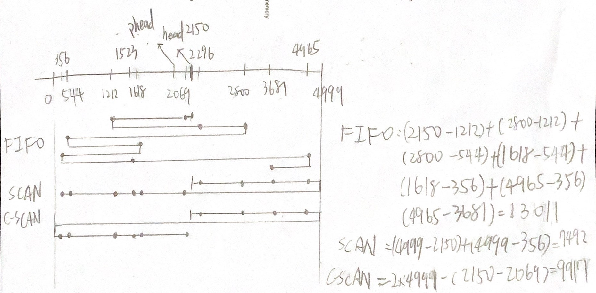

# 10.21
## Problem
Assume that we have a demand-paged memory. The page table is held in registers. It takes 8 milliseconds to service a page fault if an empty frame is available or if the replaced page is not modified and 20 milliseconds if the replaced page is modified. Memory-access time is 100 nanoseconds. Assume that the page to be replaced is modified 70 percent of the time. What is the maximum acceptable page-fault rate for an effective access time of no more than 200 nanoseconds?

## Answer

$$ pf = 8000 * 10^{-6} $$
$$ pfr = 20000 * 10^{-6} $$
$$ m = 0.1 * 10^{-6} $$
$$ x * 0.7 * 20000 + x * 0.3 * 8000 + (1-x) * 0.1 < 0.2 $$
$$ 16399.9*x < 0.1 $$ 
$$ x < 6.1 * 10^{-6} $$
$$ x \approx 6 * 10^{-6} $$

# 10.24 
## Problem
Apply the (1) FIFO (2) LRU (3) Optimal (OPT) replacement algorithms for the
following page reference string:

3, 1, 4, 2, 5, 4, 1, 3, 5, 2, 0, 1, 1, 0, 2, 3, 4, 5, 0, 1.

Indicate the number of page faults for each algorithm assuming demand paging with three frames. We will assume demand paging with three frames.

## Answer
### FIFO (First In, First Out)

1. **Initialize frames:** [_, _, _]
2. Page 3: [3, _, _] - page fault
3. Page 1: [3, 1, _] - page fault
4. Page 4: [3, 1, 4] - page fault
5. Page 2: [2, 1, 4] - page fault
6. Page 5: [2, 5, 4] - page fault
7. Page 4: no
8. Page 1: [2, 5, 1] - page fault
9. Page 3: [3, 5, 1] - page fault
10. Page 5: no
11. Page 2: [3, 5, 2] - page fault
12. Page 0: [0, 5, 2] - page fault
13. Page 1: [0, 1, 2] - page fault
14. Page 1: no
15. Page 0: no
16. Page 2: no
17. Page 3: [0, 1, 3] - page fault
18. Page 4: [0, 4, 3] - page fault
19. Page 5: [5, 4, 3] - page fault
20. Page 0: [5, 4, 0] - page fault
21. Page 1: [5, 1, 0] - page fault

Total page faults for FIFO: 15

### LRU (Least Recently Used)

1. **Initialize frames:** [_, _, _]
2. Page 3: [3, _, _] - page fault
3. Page 1: [3, 1, _] - page fault
4. Page 4: [3, 1, 4] - page fault
5. Page 2: [2, 1, 4] - page fault
6. Page 5: [2, 5, 4] - page fault
7. Page 4: no
8. Page 1: [1, 5, 4] - page fault
9. Page 3: [1, 3, 4] - page fault
10. Page 5: [1, 3, 5] - page fault
11. Page 2: [2, 3, 5] - page fault
12. Page 0: [2, 0, 5] - page fault
13. Page 1: [2, 0, 1] - page fault
14. Page 1: no
15. Page 0: no
16. Page 2: no
17. Page 3: [2, 0, 3] - page fault
18. Page 4: [2, 4, 3] - page fault
19. Page 5: [5, 4, 3] - page fault
20. Page 0: [5, 4, 0] - page fault
21. Page 1: [5, 1, 0] - page fault

Total page faults for LRU: 16

### Optimal (OPT)

1. **Initialize frames:** [_, _, _]
2. Page 3: [3, _, _] - page fault
3. Page 1: [3, 1, _] - page fault
4. Page 4: [3, 1, 4] - page fault
5. Page 2: [2, 1, 4] - page fault
6. Page 5: [5, 1, 4] - page fault
7. Page 4: no
8. Page 1: no
9. Page 3: [5, 1, 3] - page fault
10. Page 5: no
11. Page 2: [2, 1, 3] - page fault
12. Page 0: [2, 1, 0] - page fault
13. Page 1: no
14. Page 1: no
15. Page 0: no
16. Page 2: no
17. Page 3: [3, 1, 0] - no page fault
18. Page 4: [4, 1, 0] - no page fault
19. Page 5: [5, 1, 0] - no page fault
20. Page 0: no
21. Page 1: no

Total page faults for OPT: 11

### Summary

- **FIFO:** 15 page faults
- **LRU:** 16 page faults
- **Optimal:** 11 page faults

# 10.37
## Problem
What is the cause of thrashing? How does the system detect thrashing? Once it detects thrashing, what can the system do to eliminate this problem?

## Answer
### Causes
1. Insufficient Physical Memory: If the system does not have enough physical memory to accommodate the working set of all processes, thrashing can occur.
2. High Degree of Multiprogramming: If the system allows too many processes to run concurrently, the working set of each process may not fit in physical memory, leading to thrashing.
3. Poorly Tuned page replacement algorithms: If the page replacement algorithm is not well-suited to the system's workload, thrashing can occur.

### Detection
1. High Paging Activity: The system can detect thrashing by monitoring the rate of page faults. If the rate of page faults is high and the CPU utilization is low, it may indicate thrashing.

2. Low CPU Utilization: If the CPU is idle or has low utilization, it may indicate that the system is spending more time paging than executing processes, which is a sign of thrashing.

3. Increased Response Time: If the system's response time increases significantly, it may indicate that the system is thrashing.

### Resolution
1. Reduce the Degree of Multiprogramming: The system can reduce the number of processes running concurrently to free up physical memory and reduce the likelihood of thrashing.

2. Increase Physical Memory: Adding more physical memory to the system can help accommodate the working set of processes and reduce the occurrence of thrashing.

3. Improve Page Replacement Algorithms: Using more efficient page replacement algorithms can help reduce the likelihood of thrashing by making better decisions about which pages to evict from memory.

# 11.13
## Problem
Suppose that a disk drive has 5,000 cylinders, numbered 0 to 4,999. The drive is currently serving a request at cylinder 2,150, and the previous request was at cylinder 1,805. The queue of pending requests, in FIFO order, is

2,069; 1,212; 2,296; 2,800; 544; 1,618; 356; 1,523; 4,965; 3,681

Starting from the current head position, what is the total distance (in cylinders) that the disk arm moves to satisfy all the pending requests, for each of the following disk-scheduling algorithms?
- (a) FCFS 
- (b) SCAN 
- (c) C-SCAN

## Answer

# 11.20
## Problem
Consider a RAID level 5 organization comprising five disks, with the parity for sets of four blocks on four disks stored on the fifth disk. How many blocks are accessed in order to perform the following?

- (a) A write of one block of data.
- (b) A write of seven contiguous blocks of data.

## Answer
### (a) A write of one block of data
- To write one block of data, the system needs to read the old data block, read the parity block, calculate the new parity, and write the new data block and the new parity block.
- Therefore, the total number of blocks accessed is 4.

### (b) A write of seven contiguous blocks of data
- To write seven contiguous blocks of data, the system needs to read the old data blocks, read the parity block, calculate the new parity, and write the new data blocks and the new parity block. For the first 4 blocks, the parity is read and written. This involves 5 reads and 5 writes. For the next 3 blocks, the parity is read and written. This involves 4 reads and 4 writes.
- Therefore, the total number of blocks accessed is 5 + 5 + 4 + 4 = 18.

# 11.21
## Problem
Compare the throughput achieved by a RAID level 5 organization with that achieved by a RAID level 1 organization.

- (a) Read operations on single blocks.
- (b) Read operations on multiple contiguous blocks.

## Answer
### (a) Read operations on single blocks
| RAID Level | Single Block | Multiple Contiguous Blocks |
| --- | --- | --- |
| RAID 1 | Excellent (fast, as data is mirrored) | Excellent (data is mirrored, multiple disks can be read in parallel) |
| RAID 5 | Good (data is striped, requires reading parity) | Good (data is striped, can read from multiple disks in parallel, but involves parity calculations) |

# 14.14
## Problem
Consider a file system on a disk that has both logical and physical block sizes of 512 bytes. Assume that the information about each file is already in memory. For each of the three allocation strategies (contiguous, linked, and indexed), answer these questions:

- (a) How is the logical-to-physical address mapping accomplished in this system? (For indexed allocation, assume that a file is always less than 512 blocks long)
- (b) If we are currently at logical block 10 (the last block accessed was block 10) and want to access logical block 4, how many physical blocks must be read from the disk?

## Answer
### logical-to-physical
(a) 
continuous:
- use base and offset to calculate the physical address
- physical address = base + offset

linked:
- each block contains a pointer to the next block
- traverse the linked list to find the physical block

indexed:
- use the index block to store pointers to the physical blocks
- use the index block to find the physical block

(b)
contiguous: 1 block
- can calculate the physical address directly

linked: 7 blocks
- need to traverse the linked list from block 10 to block 4

indexed: 2 blocks
- need to read the index block and the physical block, 2 blocks in total

# 14.15
## Problem
Consider a file system that uses inodes to represent files. Disk blocks are 8KB in size, and a pointer to a disk block requires 4 bytes. This file system has 12 direct disk blocks, as well as single, double, and triple indirect disk blocks. What is the maximum size of a file that can be stored in this file system?

## Answer
### Maximum File Size Calculation
- Direct blocks: 12 * 8KB = 96KB
- Single indirect blocks: 8KB / 4B = 2KB, 2KB * 8KB = 16MB
- Double indirect blocks: 2KB * 2KB * 8KB = 32GB
- Triple indirect blocks: 2KB * 2KB * 2KB * 8KB = 64TB
$$ \text{Maximum file size} = 96KB + 16MB + 32GB + 64TB  \approx 64TB $$

