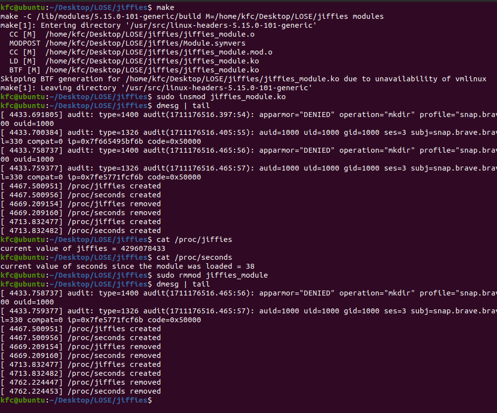

# How to use
1. Run `make` to compile the kernel module.
2. Run `sudo insmod jiffies_module.ko` to insert the module.
3. Run `lsmod | grep jiffies` to see if the module is loaded.
4. Run `dmesg` to see the output.
5. Run `sudo rmmod jiffies_module` to remove the module.
6. Run `dmesg` to see the output.

# Description
The kernel module creates a `/proc/jiffies` file and a `/proc/seconds` file. The `/proc/jiffies` file contains the number of jiffies since the system booted. The `/proc/seconds` file contains the number of seconds since the module was loaded.

# Screenshot
