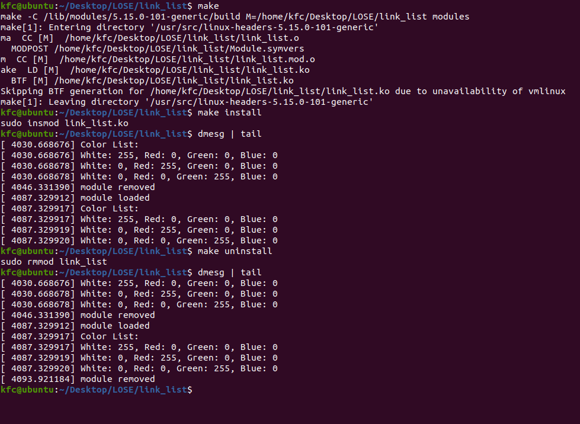

# How to use
1. Run `make` to compile the kernel module.
2. Run `make install` to insert the module.
3. Run `make mls` to see if the module is loaded.
4. Run `dmesg` to see the output.
5. Run `make rm` to remove the module.
6. Run `dmesg` to see the output.

# Description
As the screenshot shows, the kernel module prints the data in the link list. `dmesg` command is used to verify the information.

# Screenshot
