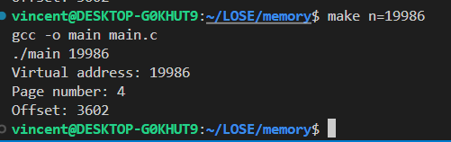

# General
This C program takes a virtual memory address as input and splits it into its corresponding page number and offset. It's a simple utility that demonstrates basic concepts of virtual memory management.

# Usage
```bash
make n=19986
```

# Implementation
The program takes one command-line argument, which should be a virtual memory address in hexadecimal format. It then converts the address to an unsigned long integer using `strtoul` function. After conversion, it prints the page number by right shifting the address by 12 bits (assuming a page size of 4 KB) and prints the offset by performing a bitwise AND operation with 0xfff.

# Screenshots

