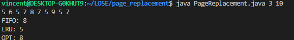

# Page Replacement Algorithm Simulation

This Java program simulates three different page replacement algorithms: FIFO (First-In-First-Out), LRU (Least Recently Used), and OPT (Optimal).

## Table of Contents

- [Requirements](#requirements)
- [Usage](#usage)
- [Description](#description)
- [Screenshots](#screenshots)

## Requirements

- JDK (Java Development Kit) >= 11

## Usage

To run the program
```bash
java PageReplacement.java <pageFrame> <referenceStringLength>
```

### Arguments

- `pageFrame`: The number of page frames.
- `referenceStringLength`: The length of the reference string.

For example:

```bash
java PageReplacement.java 3 10
```

## Description

The `PageReplacement` class simulates page replacement algorithms. It generates a random reference string of a given length and simulates the three algorithms to count the number of page faults for each.

### Main Components

- `PageReplacement`: Constructor to initialize the page frame and reference string length.
- `generateReferenceString()`: Generates a random reference string.
- `printReferenceString()`: Prints the generated reference string.
- `fifo()`: Simulates the FIFO page replacement algorithm.
- `lru()`: Simulates the LRU page replacement algorithm.
- `opt()`: Simulates the OPT page replacement algorithm.

### Algorithms

1. **FIFO (First-In-First-Out)**:
    - Uses a queue to keep track of pages.
    - When a page fault occurs and the page frame is full, the oldest page (the one that arrived first) is removed.

2. **LRU (Least Recently Used)**:
    - Uses a queue to keep track of pages.
    - When a page fault occurs, if the page frame is full, the least recently used page is removed.
    - When a page is accessed, it is moved to the back of the queue.

3. **OPT (Optimal)**:
    - Looks ahead in the reference string to find the page that will not be used for the longest period of time.
    - When a page fault occurs and the page frame is full, this algorithm replaces the page that is not needed for the longest duration in the future.

## Screenshots
