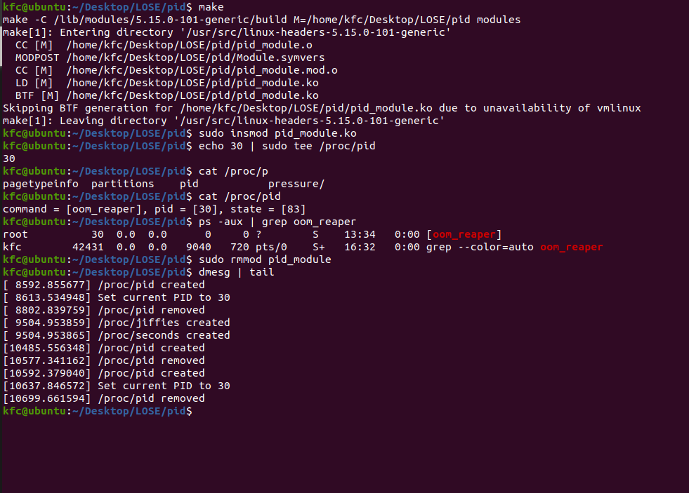

# How to use
1. Run `make` to compile the kernel module.
2. Run `sudo insmod pid_module.ko` to insert the module.
3. Run `lsmod | grep pid` to see if the module is loaded.
4. Run `dmesg` to see the output.
5. Run `sudo rmmod pid_module` to remove the module.
6. Run `dmesg` to see the output.

# Description
As the screenshot shows, the kernel module prints the process information of pid 30. `ps` command is used to verify the information.

# Screenshot
