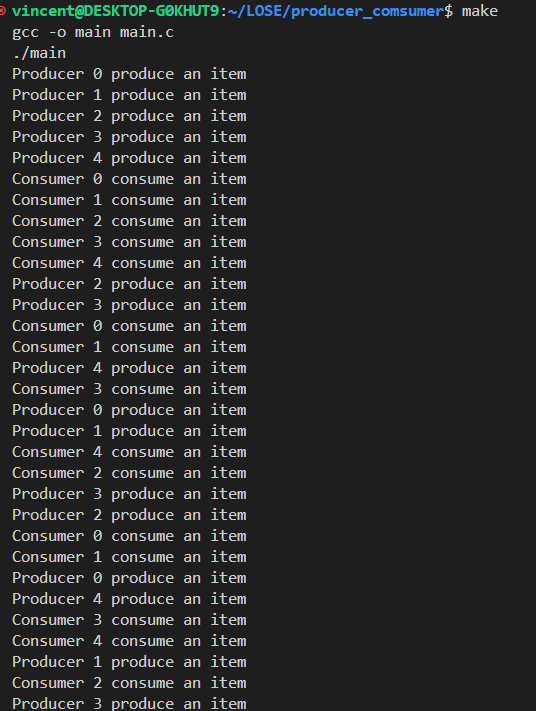

# General
This code implements a simple producer-consumer problem solution using pthreads (POSIX threads) and semaphores in C. The producer-consumer problem involves two processes, the producer and the consumer, who share a common, fixed-size buffer as a queue. The producer produces items and places them into the buffer, while the consumer consumes items from the buffer.

# Usage
```bash
make
```

# Implementation
The implementation consists of several parts:

1. **Constants**: 
   - `BUFFER_SIZE`: Defines the size of the buffer.
   - `PRODUCER_NUM`: Defines the number of producer threads.
   - `CONSUMER_NUM`: Defines the number of consumer threads.

2. **Global Variables**:
   - `buffer`: An array representing the shared buffer.
   - `in`: Index to track the position where the next item will be inserted into the buffer.
   - `out`: Index to track the position from where the next item will be consumed from the buffer.

3. **Thread Functions**:
   - `producer(void *arg)`: Function executed by producer threads. It continuously produces items and places them into the buffer.
   - `consumer(void *arg)`: Function executed by consumer threads. It continuously consumes items from the buffer.

4. **Main Function**:
   - Creates and initializes semaphores (`empty` and `full`) and a mutex (`mutex`) for synchronization.
   - Creates producer and consumer threads.
   - Waits for all threads to finish execution.
   - Destroys semaphores and mutex.

5. **Synchronization**:
   - `pthread_mutex_t mutex`: Protects access to the shared buffer by ensuring only one thread modifies it at a time.
   - `sem_t empty` and `sem_t full`: Semaphore implementation to control the number of empty and full slots in the buffer, respectively. They ensure that producers wait when the buffer is full and consumers wait when the buffer is empty.

6. **Sleep Functionality**:
   - `sleep(1)`: Each producer and consumer thread sleeps for one second after producing/consuming an item to simulate processing time.

# Screenshots
The following screenshots show the output of the program when run with five producer and five consumer threads.

