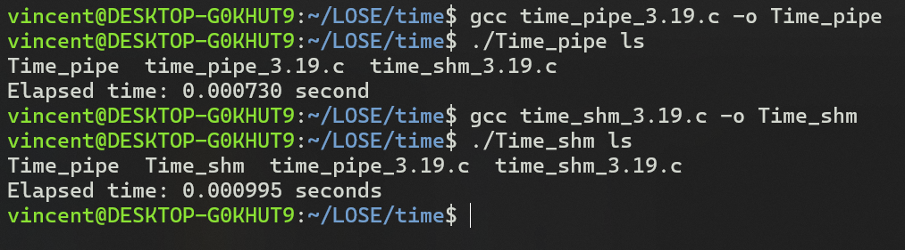

# 2.24 Copy files
## Usage
```bash
gcc file_copy.c -o File_copy
./File_copy file1 file2
``` 

## Screenshot


# 3.19 Time command evaluation using pipe and shared memory
## Usage
```bash
gcc time_pipe.c -o Time_pipe
./Time_pipe ls
gcc time_shm.c -o Time_shm
./Time_shm ls
```

## Screenshot


# 3.21 Collatz Conjecture
## Usage
```bash
gcc cc.c -o cc
./cc 70
```

## Screenshot


# 3.27 Copy files using pipe
## Usage
```bash
gcc file_copy_pipe.c -o File_copy_pipe
./File_copy_pipe file1 file2
```

## Screenshot
