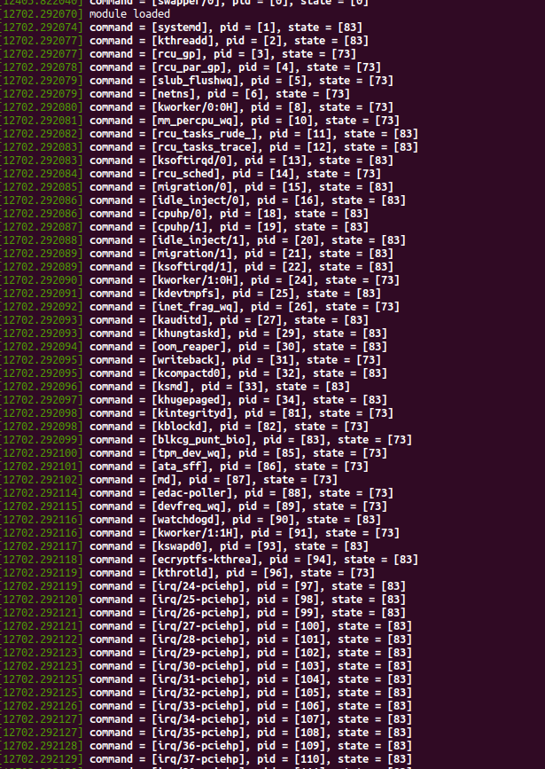

# How to use
1. Run `make` to compile the kernel module.
2. Run `sudo insmod task_list.ko` to insert the module.
3. Run `lsmod | grep task_list` to see if the module is loaded.
4. Run `dmesg` to see the output.
5. Run `sudo rmmod task_list` to remove the module.
6. Run `dmesg` to see the output.

# Description
The kernel module prints the process information of all the tasks in the system. The information includes the command name, the process ID and the state of the process. 

The order of the tasks is determined by the process ID.

# Screenshot
