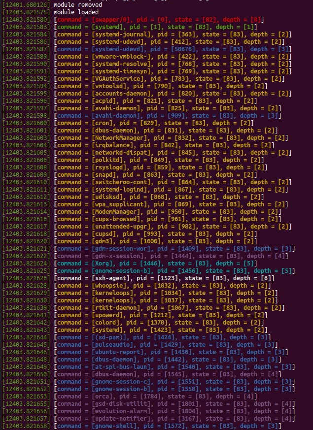

# How to use
1. Run `make` to compile the kernel module.
2. Run `sudo insmod task_list_dfs.ko` to insert the module.
3. Run `lsmod | grep task_list` to see if the module is loaded.
4. Run `dmesg` to see the output.
5. Run `sudo rmmod task_list_dfs` to remove the module.
6. Run `dmesg` to see the output.

# Description
The kernel module prints the process information of all the tasks in the system. The information includes the command name, the process ID, the state of the process and the depth of the task.

The order of the tasks is determined by the algorithm of depth-first search. The tasks are colored according to the depth of the task.

As the screenshot shows, there are the color codes for the tasks:
- Red: depth 0
- Green: depth 1
- Yellow: depth 2
- Blue: depth 3
- Magenta: depth 4
- Cyan: depth 5
- White: depth 6

# Screenshot
