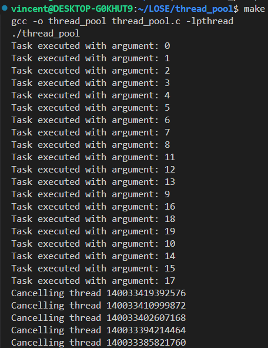

# Designing a Thread Pool

## Introduction

A thread pool is a collection of threads that can be used to execute tasks. It is a programming technique that is used to reduce the overhead of thread creation and destruction. A thread pool maintains a queue of tasks that are waiting to be executed. When a thread in the pool becomes available, it takes a task from the queue and executes it. This allows the application to reuse threads and avoid the overhead of creating new threads.

## Usage

```bash
make
```

## Implementation

`thread_t` is a struct that represents a thread in the thread pool. `task_t` is a struct that represents a task that can be executed by a thread. The `thread_pool_t` struct represents the thread pool itself.

In the function of `thread_pool_init`, we initialize the thread pool with the specified number of threads. We create a pool of threads and add them to the thread pool. Each thread is created with a function that will execute tasks from the task queue. Once `pthread_create` is called, the new thread starts execution by invoking start_routine, which is `thread_function` in this case. 

Inside `thread_function` function, if the task queue is empty, the thread waits for a signal, which is implemented by `pthread_cond_wait`, from the `thread_pool_submit` function which adds a task to the task queue.

`thread_pool_submit` is a function that adds a task to the task queue. If the queue is full for the task, `pthread_cond_wait` function is called to wait for the queue to have space. Once the task is added to the queue, a signal is sent to the waiting thread to start executing the task, mentioned above.

To compare, `thread_pool_submit` is blocked by conditional variable if the task queue is full, and `thread_function` is blocked by conditional variable if the task queue is empty.

In terms of the integrity of the demonstration, main function does not use `pthread_join` to wait for the threads to finish. Instead, it uses `sleep` function to wait a decent amount of time before all threads finish their execution. Because the nature of the thread pool is to keep the threads alive and reuse them, the main function does not need to wait for the threads to finish.
## Screenshots



